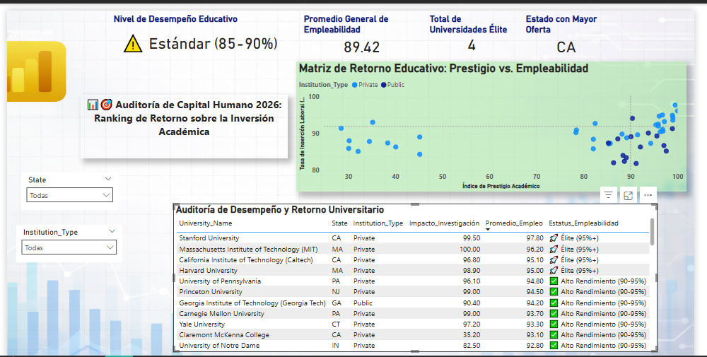

# 📊 Auditoría de Capital Humano 2026: Retorno de Inversión Académica (US Top 50)

## 🎯 Objetivo del Proyecto
Este dashboard interactivo analiza la eficiencia de las 50 mejores universidades de EE.UU., evaluando la relación entre su **Prestigio Académico (Investigación)** y su **Impacto Laboral (Empleabilidad)**. Como especialista en análisis de datos, el enfoque fue auditar dónde se genera el mayor valor real para el capital humano.

---

## 🖥️ Visualización del Dashboard

> *Vista estratégica con KPIs de rendimiento, matriz de correlación y auditoría detallada por institución.*

---

## 🛠️ Stack Técnico y Metodología
* **Power BI Desktop:** Modelado de datos y diseño de interfaz de usuario (UI/UX).
* **DAX Avanzado:** Implementación de métricas inteligentes para segmentación dinámica.
* **Análisis de Correlación:** Evaluación de variables de investigación vs. inserción laboral.

### Lógica DAX Implementada
Se utilizó una lógica de segmentación profesional para clasificar el rendimiento de cada universidad:

```dax
Estatus_Empleabilidad = 
SWITCH( TRUE(),
    [Employment_Rate] >= 95, "🚀 Élite (95%+)",
    [Employment_Rate] >= 90, "✅ Alto Rendimiento (90-95%)",
    [Employment_Rate] >= 85, "⚠️ Estándar (85-90%)",
    "🚨 Bajo Umbral"
)
